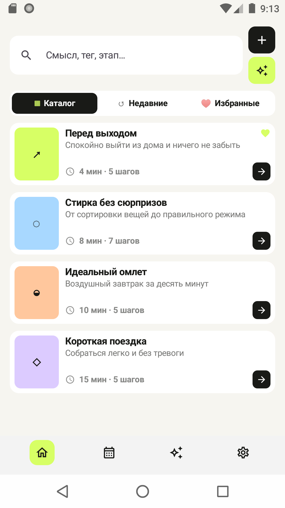
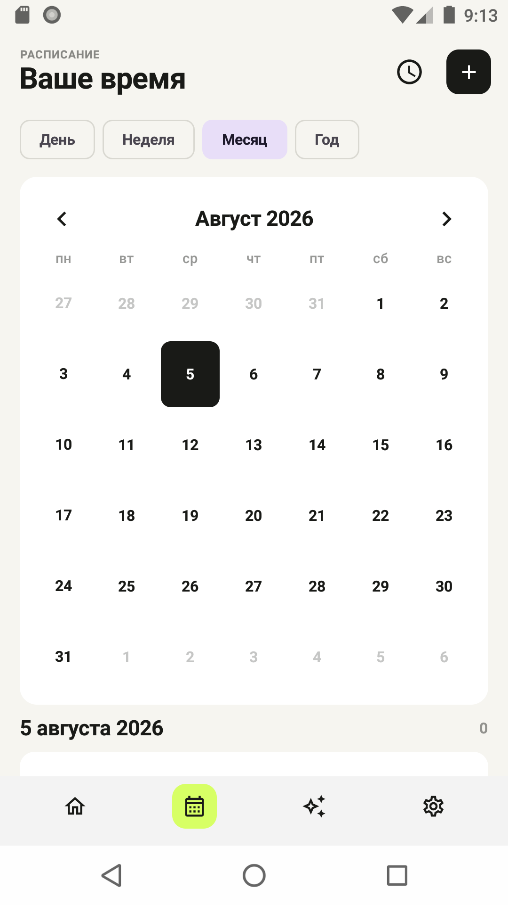
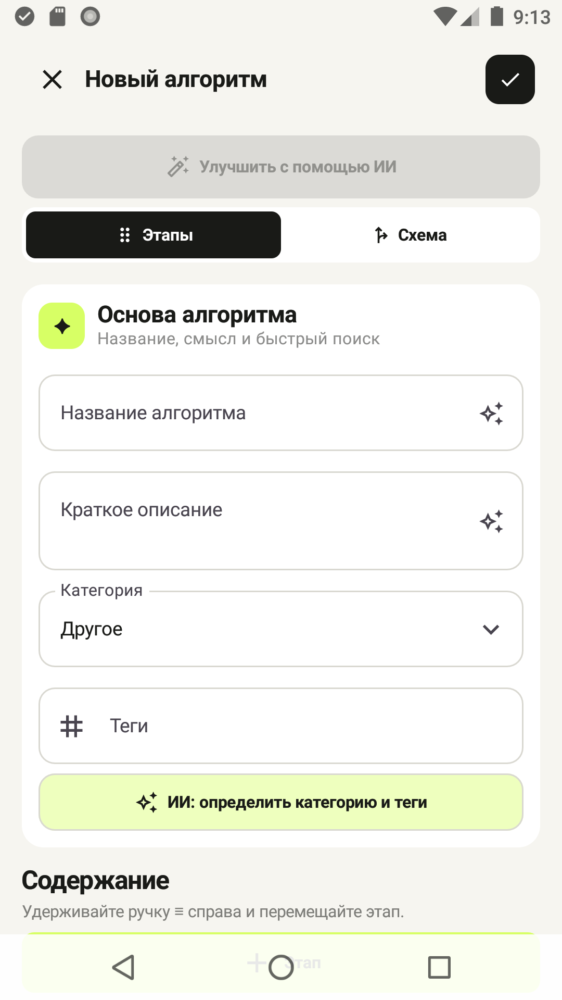
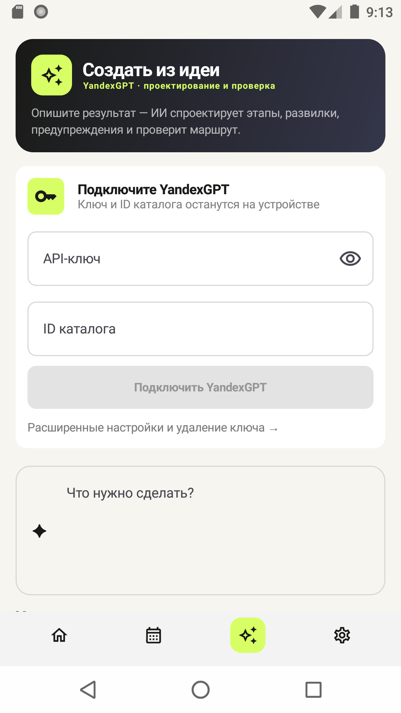

# Алгоритмы

> Личные инструкции, которые помогают не держать всё в голове.

Повторяющиеся дела часто кажутся простыми, пока не приходится выполнять их в спешке, в усталости или после долгого перерыва. В такие моменты легко забыть важный шаг, неверно оценить время или отвлечься на середине процесса. **«Алгоритмы» превращают задачу в понятный маршрут:** приложение показывает только текущий шаг, запоминает прогресс и вовремя напоминает о продолжении.

Приложение особенно полезно для бытовых рутин, сборов, готовки, уборки, обслуживания техники, рабочих регламентов и любых процессов с несколькими этапами. Один раз составьте хороший алгоритм — вручную или с помощью YandexGPT — а затем используйте его как спокойную внешнюю память для себя, семьи или команды.

<p align="center">
  <a href="https://github.com/Sadsadhead/ritual-android/releases/latest/download/algorithms-v0.1.0.apk">
    
  </a>
  <a href="https://github.com/Sadsadhead/ritual-android/releases/latest">
    
  </a>
</p>

> [!IMPORTANT]
> Сейчас распространяется тестовая APK-сборка `0.1.0` для Android 8.0 и новее. Данные хранятся только на устройстве, поэтому перед удалением приложения сохраните важные алгоритмы вручную.

## Содержание

- [Где приложение особенно эффективно](#где-приложение-особенно-эффективно)
- [Скриншоты](#скриншоты)
- [Как установить](#как-установить)
- [Как пользоваться](#как-пользоваться)
- [Создание с помощью YandexGPT](#создание-с-помощью-yandexgpt)
- [Что умеет приложение](#что-умеет-приложение)
- [Конфиденциальность и разрешения](#конфиденциальность-и-разрешения)
- [Для разработчиков](#для-разработчиков)

## Где приложение особенно эффективно

| Ситуация | Пример алгоритма | Польза |
| --- | --- | --- |
| 🚪 Сборы и выход из дома | Документы → ключи → техника → окна | Меньше тревоги и возвратов домой |
| 🧳 Поездка | Одежда → лекарства → зарядки → билеты | Ничего важного не останется дома |
| 🍳 Готовка | Подготовка → действия → таймеры → подача | Рецепт не нужно перечитывать целиком |
| 🧹 Уборка | Комнаты, средства и порядок действий | Большая задача превращается в короткие шаги |
| 🔧 Обслуживание | Проверка → безопасное отключение → работа → контроль | Важные подготовительные действия не пропускаются |
| 💼 Рабочий процесс | Чек-лист публикации, проверки или передачи смены | Результат меньше зависит от памяти и спешки |

Хороший алгоритм описывает не идеальный день, а реальную ситуацию: добавляйте предупреждения, варианты ответа, фотографии и таймеры там, где обычно возникают ошибки.

## Скриншоты

<table>
  <tr>
    <td align="center"><strong>Каталог алгоритмов</strong></td>
    <td align="center"><strong>Пошаговое выполнение</strong></td>
    <td align="center"><strong>Расписание</strong></td>
  </tr>
  <tr>
    <td></td>
    <td></td>
    <td></td>
  </tr>
  <tr>
    <td align="center"><strong>Ручной редактор</strong></td>
    <td align="center"><strong>Создание с YandexGPT</strong></td>
    <td align="center"><strong>Схемы и ветвления</strong></td>
  </tr>
  <tr>
    <td></td>
    <td></td>
    <td valign="middle">Условия позволяют направлять пользователя по разным шагам в зависимости от ответа. Прогресс рассчитывается по фактически выбранному маршруту.</td>
  </tr>
</table>

## Как установить

1. Нажмите **[«Скачать APK»](https://github.com/Sadsadhead/ritual-android/releases/latest/download/algorithms-v0.1.0.apk)**.
2. Откройте загруженный файл `algorithms-v0.1.0.apk` на Android-устройстве.
3. Если Android попросит разрешение, временно разрешите установку из используемого браузера или файлового менеджера.
4. Подтвердите установку и откройте приложение **«Алгоритмы»**.

> [!NOTE]
> Google Play не участвует в установке этой тестовой версии, поэтому системное предупреждение об APK из внешнего источника ожидаемо. Загружайте файл только со страницы релизов этого репозитория.

**Минимальные требования:** Android 8.0 (API 26) или новее. Камера необязательна — без неё недоступны только фото- и видеозаметки.

## Как пользоваться

### 1. Выберите готовый алгоритм

На главной странице уже есть демонстрационные сценарии. Используйте поиск, переключайтесь между каталогом, недавними и избранными. Нажмите стрелку на карточке, чтобы начать выполнение.

### 2. Выполняйте по одному шагу

Runner скрывает всё лишнее и показывает текущую инструкцию. Отметьте действие, выберите вариант или дождитесь таймера — приложение переведёт вас дальше и сохранит активный запуск.

- **«Да / Нет» и выбор варианта** могут открывать разные ветки;
- **таймер** продолжает работать в фоне;
- **фото, видео, аудио и файлы** помогают сохранить контекст прямо у нужного шага;
- активный алгоритм можно закрыть и продолжить позже с того же места.

### 3. Создайте свой алгоритм вручную

Нажмите **`+`** на главной странице:

1. укажите название, краткое описание, категорию и теги;
2. добавьте этапы и выберите тип каждого шага;
3. при необходимости добавьте подпункты, варианты ответа, таймер или вложения;
4. откройте вкладку **«Схема»**, чтобы проверить ветвления;
5. нажмите галочку для сохранения.

Доступные типы шагов:

| Тип | Когда использовать |
| --- | --- |
| Информация | Объяснение без обязательного действия |
| Предупреждение | Риск, ограничение или важная проверка |
| Чек-лист | Одно действие или несколько подпунктов |
| Да / Нет | Простая развилка |
| Один вариант | Выбор одного дальнейшего сценария |
| Несколько вариантов | Несколько применимых ответов |
| Таймер | Ожидание с уведомлениями |
| Финал | Явное завершение маршрута |

### 4. Добавьте дело в расписание

Откройте вкладку с календарём и нажмите **`+`**. Создайте разовое или повторяющееся событие, укажите время напоминания и при желании свяжите его с алгоритмом. Из уведомления или календаря можно сразу перейти к выполнению.

### 5. Улучшайте алгоритмы после использования

Если инструкция оказалась слишком длинной, непонятной или пропустила важный случай, откройте её в редакторе. Можно изменить отдельный шаг вручную либо запросить AI-улучшение и принять только подходящие правки после предпросмотра.

## Создание с помощью YandexGPT

YandexGPT может спроектировать этапы, предупреждения и развилки по короткому описанию результата. Например:

```text
Составь алгоритм подготовки квартиры к отъезду на неделю.
Учти воду, электроприборы, окна, мусор, растения и передачу ключей.
В конце добавь контрольную проверку.
```

Чтобы подключить AI:

1. создайте сервисный аккаунт в Yandex Cloud;
2. выдайте ему минимально необходимую роль `yc.ai.languageModels.execute`;
3. создайте API-ключ и узнайте ID каталога;
4. в приложении откройте вкладку **«Создать»** или **«Настройки»**;
5. введите ключ и ID каталога, затем сохраните;
6. опишите желаемый результат и проверьте созданный черновик перед сохранением.

> [!WARNING]
> Используйте отдельный сервисный аккаунт, ограничивайте срок действия ключа и расходы. Не публикуйте ключ в issue, скриншотах или файлах репозитория.

## Что умеет приложение

- [x] локальная библиотека алгоритмов;
- [x] поиск, избранное, недавние и дублирование;
- [x] визуальный редактор шагов и ветвлений;
- [x] восстановление активных запусков;
- [x] таймеры и фоновые уведомления;
- [x] фото, видеокружки, аудио и файлы;
- [x] календарь, повторения и напоминания;
- [x] виджеты алгоритмов и расписания;
- [x] генерация и улучшение через YandexGPT;
- [x] Markdown в описаниях шагов;
- [x] светлая и тёмная темы.

## Конфиденциальность и разрешения

Алгоритмы, расписание, история, настройки и реквизиты Yandex Cloud хранятся локально. API-ключ шифруется с помощью `AES/GCM`, а ключ шифрования создаётся в Android Keystore и не экспортируется. Резервное копирование данных приложения отключено.

| Разрешение | Зачем нужно |
| --- | --- |
| Интернет | Обращение к YandexGPT |
| Камера и микрофон | Фото-, видео- и аудиозаметки |
| Уведомления | Таймеры, расписание и активные алгоритмы |
| Точные будильники | Напоминания в выбранное время |
| Запуск после перезагрузки | Восстановление запланированных напоминаний |

Разрешения запрашиваются только для соответствующих функций. Реквизиты Yandex Cloud можно полностью удалить в настройках.

<details>
<summary><strong>Частые вопросы</strong></summary>

### Нужен ли интернет?

Для создания, редактирования и выполнения обычных алгоритмов — нет. Интернет нужен только функциям YandexGPT.

### Обязательно ли подключать YandexGPT?

Нет. Все алгоритмы можно создавать и изменять вручную.

### Почему после удаления приложения пропали данные?

Данные хранятся локально, а Android backup намеренно отключён ради защиты API-ключа. Текущая тестовая версия не синхронизирует данные с облаком.

### Можно ли установить приложение без камеры?

Да. Камера объявлена необязательной; остальные функции продолжат работать.

</details>

## Для разработчиков

<details>
<summary><strong>Стек и команды сборки</strong></summary>


Требуются JDK 17 и Android SDK 36.

```bash
git clone https://github.com/Sadsadhead/ritual-android.git
cd ritual-android
./gradlew :app:assembleDebug
./gradlew :app:testDebugUnitTest
```

APK после сборки: `app/build/outputs/apk/debug/app-debug.apk`.

</details>

---

<p align="center">
  <strong>Один понятный шаг сейчас лучше, чем вся задача в голове.</strong>
</p>
